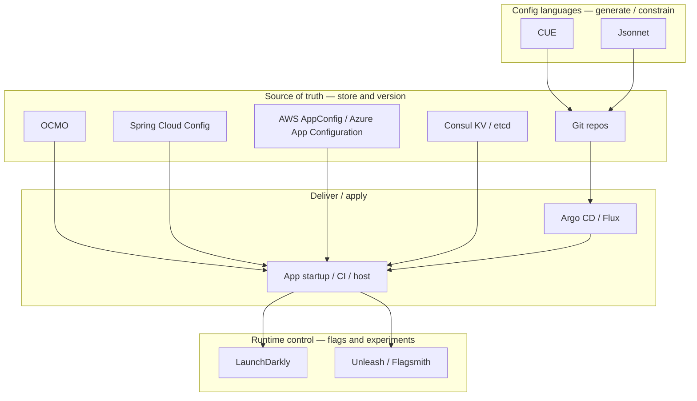

# Comparison with other products

OCMO is a **configuration-file platform**: it stores versioned YAML trees, runs them through a resolve pipeline (parameters → extend → Jinja2 render → cast), injects secrets at resolve time, and delivers signed artifacts over a REST API (also CLI, Python SDK, and web UI).

This page compares that job with products people often reach for instead. Most of them are **not** drop-in substitutes. They occupy different layers of the same problem (source control, GitOps apply, config *languages*, cloud key-value, distributed KV, feature flags). Treating them as interchangeable is how teams end up with both gaps and duplicated machinery.

> [!NOTE]
> License and list-price figures are a snapshot as of **August 2026**. Vendors change plans. Always check the vendor's current pricing page before a purchase decision. OCMO itself is Apache 2.0; it is **not production-ready until 1.0.0**.

---

## Global design differences

The useful split is **what each product is for**, not a feature checklist.

| Axis                | What it means                                                   | OCMO's position                                                                                                                                                   |
| ------------------- | --------------------------------------------------------------- | ----------------------------------------------------------------------------------------------------------------------------------------------------------------- |
| **Unit of data**    | Whole files vs key-value vs boolean flags                       | Whole documents (YAML configs, Jinja2 templates). Cast to JSON, env, HCL, or raw text.                                                                            |
| **Source of truth** | Git, a database, a cloud API                                    | PostgreSQL-backed tree. Git is a backup/export target, not the live store. Git sync is reserved and **not implemented**.                                          |
| **Composition**     | Copy-paste, overlays, inheritance, a language                   | Deep-merge `extend`, `{!parameter}` injection, optional Jinja2 templates, JSON Schema on write.                                                                   |
| **Delivery**        | Clone a repo, reconcile a cluster, poll KV, evaluate a flag SDK | `resolve` → artifact + short-lived signed download URL. CI, app SDK, init container, or host agent.                                                               |
| **Who consumes it** | Humans in PRs, K8s controllers, in-process SDKs                 | Operators (UI/CLI) and machines (resolver tokens). Not a K8s controller and not a flag evaluation SDK.                                                            |
| **Change model**    | Commits, deployments, watches, percentage rollouts              | Immutable versions + tags (`latest`, `stable`, custom). Optional [propagation](features/propagation.md) to other paths. [Locks](features/locks.md) freeze writes. |
| **AuthZ grain**     | Repo ACLs, K8s RBAC, IAM, flag-project roles                    | OIDC identities + two-tier ABAC (global namespace rules + per-namespace `_permissions`). Path-scoped [resolvers](features/resolvers.md).                          |
| **Secrets**         | Don't put them in Git; use a vault; Key Vault refs              | Encrypted Secret items (AES-256-GCM, per-namespace DEK). Injected at resolve. Not a Vault replacement.                                                            |
| **Where it runs**   | Your cluster, a cloud region, a SaaS                            | Self-hosted. You own Postgres, the master key, and the IdP.                                                                                                       |

**OCMO is closer to "a Git for config files, plus a resolve/render service"** than to GitOps, feature flags, or etcd. It is **not**:

- a GitOps engine (it does not reconcile Kubernetes)
- a config language (it stores YAML and optionally renders Jinja2; it does not type-check like CUE)
- a distributed consensus store
- a feature-flag / experimentation product
- a full secrets manager ([Vault](https://www.hashicorp.com/en/products/vault) remains the right tool for that)

---

## Job-to-be-done map

| Product                     | Primary job                                                      | Typical unit                        | Applies config to runtime?                 |
| --------------------------- | ---------------------------------------------------------------- | ----------------------------------- | ------------------------------------------ |
| **OCMO**                    | Store, version, compose, and *resolve* configuration files       | YAML document at a tree path        | Delivers artifacts; you (or CI) place them |
| **Git**                     | Version source, including config files                           | Files in a repo                     | No — clone/checkout only                   |
| **Argo CD / Flux**          | Make a Kubernetes cluster match Git                              | K8s manifests / Helm / Kustomize    | Yes — cluster reconcile                    |
| **CUE / Jsonnet**           | Generate and constrain config as code                            | Language source → JSON/YAML         | No — compile locally or in CI              |
| **Spring Cloud Config**     | Serve Spring `application.yml` (and friends) from Git/Vault/JDBC | `{app}/{profile}` property files    | Yes — Spring client refresh                |
| **AWS AppConfig**           | Deploy validated app config / flags with rollout + rollback      | Application / environment / profile | Yes — agent or AWS APIs                    |
| **Azure App Configuration** | Hosted key-value + feature flags for Azure apps                  | Key + label                         | Yes — SDK refresh                          |
| **Consul**                  | Service discovery / mesh; KV is a side store                     | Path in a flat KV                   | Watch / `consul-template`                  |
| **etcd**                    | Strongly consistent distributed KV                               | Key + revision                      | Watch; you build the rest                  |
| **Unleash / Flagsmith**     | Feature flags and targeting; some remote config                  | Flag + context                      | Yes — in-process SDK                       |
| **LaunchDarkly**            | SaaS feature management, experiments, guarded releases           | Flag + context                      | Yes — in-process SDK                       |

---

## Capability matrix (config-file management)

Legend: **Yes** = first-class for this job. **Partial** = possible with extra tooling or a different data model. **No** = not the product's job.

| Capability                                     | OCMO           | Git                | Argo/Flux               | CUE/Jsonnet       | Spring Cloud Config         | AWS AppConfig                     | Azure App Config   | Consul                   | etcd                | Unleash/Flagsmith          | LaunchDarkly       |
| ---------------------------------------------- | -------------- | ------------------ | ----------------------- | ----------------- | --------------------------- | --------------------------------- | ------------------ | ------------------------ | ------------------- | -------------------------- | ------------------ |
| Hierarchical file/tree store                   | Yes            | Yes                | Partial¹                | No                | Partial²                    | No                                | Partial³           | Partial                  | Partial             | No                         | No                 |
| Immutable versions + tags                      | Yes            | Yes (commits/tags) | Git's                   | No                | Git labels                  | Deployment versions               | 7–30 day history   | No⁴                      | MVCC revisions      | Flag revisions             | Flag versions      |
| Merge / inherit configs                        | Yes (`extend`) | Manual / overlays  | Kustomize/Helm          | Yes (language)    | Profiles / overlays         | No                                | Key labels         | No                       | No                  | No                         | Flag prerequisites |
| Template → arbitrary files (nginx, systemd, …) | Yes (Jinja2)   | You write files    | Helm/Jsonnet (K8s)      | Yes               | Spring placeholders         | No                                | No                 | consul-template          | No                  | No                         | No                 |
| Cast to JSON / env / HCL                       | Yes            | No                 | No                      | Export JSON       | Properties/YAML             | JSON/YAML/text                    | KV strings         | Raw KV                   | Raw KV              | JSON payloads              | JSON payloads      |
| JSON Schema (or equivalent) on write           | Yes            | CI only            | Policy engines          | CUE is the schema | Limited                     | JSON Schema / Lambda              | Partial            | No                       | No                  | Flag schemas (paid/varies) | Flag schemas       |
| Encrypted secrets in-tree                      | Yes            | **Don't**          | Sealed secrets / ESO    | No                | Encrypt API / Vault backend | Parameter Store / Secrets Manager | Key Vault refs     | Vault integration / ACLs | No                  | Partial                    | Partial            |
| Fine-grained path ABAC                         | Yes            | Repo/CODEOWNERS    | K8s RBAC + AppProject   | N/A               | HTTP basic / OAuth (coarse) | IAM                               | Azure RBAC         | ACL tokens               | Auth roles          | Project/env roles          | Project/env roles  |
| Audit log                                      | Yes            | `git log` + forge  | Controller events       | N/A               | Actuator / your logging     | CloudTrail                        | Azure Activity Log | Enterprise               | Partial             | Plan-dependent             | Yes                |
| Runtime fetch API / SDK                        | Yes            | No                 | Git only                | N/A               | Yes (Spring-first)          | Yes                               | Yes                | Yes                      | Yes                 | Yes (flag eval)            | Yes (flag eval)    |
| Progressive % rollout / targeting              | No             | No                 | Argo Rollouts / Flagger | No                | No                          | Yes                               | Feature flags      | No                       | No                  | Yes                        | Yes                |
| Kubernetes reconcile                           | No             | No                 | **Yes**                 | No                | No                          | No                                | No                 | Consul on K8s            | etcd *is* K8s store | No                         | No                 |
| Self-host                                      | Yes            | Yes                | Yes                     | Yes (CLI)         | Yes                         | No                                | No                 | Yes                      | Yes                 | Yes                        | **No**             |
| Feature flags as core UX                       | No             | No                 | No                      | No                | No                          | Yes                               | Yes                | No                       | No                  | **Yes**                    | **Yes**            |

¹ GitOps tools consume Git trees; they do not *manage* a config tree of their own.  
² Layout is `{application}/{profile}` files, usually in Git — not a general multi-format file tree.  
³ Hierarchical *keys* (`app:db:host`), not files.  
⁴ Consul KV has no first-class version history comparable to Git or OCMO.

---

## License, pricing, vendor lock

| Product                     | License                                                                                                                                                            | Pricing (list, Aug 2026)                                                                                                                                                                                                                                                                                                                         | Vendor lock                                                                                                                                                  | Exit path                                                                                |
| --------------------------- | ------------------------------------------------------------------------------------------------------------------------------------------------------------------ | ------------------------------------------------------------------------------------------------------------------------------------------------------------------------------------------------------------------------------------------------------------------------------------------------------------------------------------------------ | ------------------------------------------------------------------------------------------------------------------------------------------------------------ | ---------------------------------------------------------------------------------------- |
| **OCMO**                    | [Apache 2.0](https://www.apache.org/licenses/LICENSE-2.0)                                                                                                          | **$0 license.** You pay for compute, Postgres, and ops.                                                                                                                                                                                                                                                                                          | Low. Self-hosted; YAML export; REST/CLI. `_ocmo` metadata is OCMO-specific.                                                                                  | `[ocmo export](how-to/export-import.md)` / `get --raw` dumps YAML. Re-home files in Git. |
| **Git**                     | Git: GPL-2.0. Forges: GitHub proprietary; GitLab MIT + EE; Gitea MIT                                                                                               | Self-host: infra. GitHub/GitLab: per-user or usage plans                                                                                                                                                                                                                                                                                         | Low for plain Git. Higher if you depend on GitHub Actions, CODEOWNERS, or forge PRs                                                                          | `git clone --mirror`. Standard.                                                          |
| **Argo CD**                 | Apache 2.0 (CNCF)                                                                                                                                                  | **$0.** Optional paid platforms (e.g. Akuity) and support                                                                                                                                                                                                                                                                                        | Low for the controller. Medium if your process only exists as Application CRDs                                                                               | Manifests stay in Git. Drop the controller.                                              |
| **Flux**                    | Apache 2.0 (CNCF)                                                                                                                                                  | **$0.** Optional enterprise support                                                                                                                                                                                                                                                                                                              | Same idea as Argo CD; CRDs are Flux-specific                                                                                                                 | Manifests stay in Git.                                                                   |
| **CUE**                     | Apache 2.0                                                                                                                                                         | **$0** for the language. Optional CUE Labs commercial tooling                                                                                                                                                                                                                                                                                    | Low. Output is JSON/YAML. Source is `.cue`                                                                                                                   | Keep generated YAML; rewrite `.cue` if you leave the language                            |
| **Jsonnet**                 | Apache 2.0                                                                                                                                                         | **$0**                                                                                                                                                                                                                                                                                                                                           | Low. Same as CUE                                                                                                                                             | Keep generated JSON/YAML                                                                 |
| **Spring Cloud Config**     | Apache 2.0                                                                                                                                                         | **$0** for the project. You run the server                                                                                                                                                                                                                                                                                                       | **High for JVM shops** — clients, refresh, and bus are Spring-idiomatic. HTTP API exists for others                                                          | Config files usually already live in Git                                                 |
| **AWS AppConfig**           | Proprietary AWS service                                                                                                                                            | Pay-as-you-go: **$0.0000002** per configuration *request*, **$0.0008** per configuration *received*, **$0.90**/hour for experiments. Agent recommended to control request volume. See [Systems Manager pricing](https://aws.amazon.com/systems-manager/pricing/)                                                                                 | **High.** IAM, ARNs, agents, deployment strategies, CloudWatch rollback                                                                                      | Export profiles; reimplement rollout. No on-prem equivalent                              |
| **Azure App Configuration** | Proprietary Azure service                                                                                                                                          | **Free** (eval, 10 MB, 1k req/day). **Developer** ~~$0.12/store/day + overage. **Standard** ~$1.20/store/day (~~$36/mo) incl. 200k req/day. **Premium** ~~$9.60/store/day (~~$288/mo) incl. replica. Overage ~$0.06–$0.40 per 10k requests depending on tier. [Official pricing](https://azure.microsoft.com/pricing/details/app-configuration/) | **High.** Azure RBAC, Key Vault, private link, replicas                                                                                                      | Export keys; 7–30 day revision history is not a full archive                             |
| **Consul**                  | Community: **BSL 1.1** (source-available; production OK except competing offerings). Pre-2023 releases: MPL-2.0. Enterprise: proprietary. APIs/SDKs mostly MPL-2.0 | CE: **$0** + cluster ops. HCP Consul: usage (cluster-hour + service instances; historically on the order of tens of cents per hour plus per-instance). Enterprise: IBM/HashiCorp quote                                                                                                                                                           | Medium. KV is portable; service mesh, intentions, and HCP are not                                                                                            | Dump KV (`consul kv export`). Mesh is a migration project                                |
| **etcd**                    | Apache 2.0 (CNCF)                                                                                                                                                  | **$0** + cluster ops. Cloud vendors sell managed etcd                                                                                                                                                                                                                                                                                            | Low as a KV. High if you encoded all app config in etcd and nowhere else                                                                                     | `etcdctl get --prefix` / snapshot                                                        |
| **Unleash**                 | OSS **AGPLv3** from v8 (Docker images remain Apache 2.0). Enterprise: proprietary                                                                                  | OSS self-host: **$0**. Cloud PAYG: **$75/seat/month** (typical 5-seat minimum). Enterprise: quote. [Pricing](https://www.getunleash.io/pricing)                                                                                                                                                                                                  | Medium. SDKs are standard; admin API and strategies are Unleash-shaped. AGPL affects *modified* server source, not typical SDK use                           | Export flags; rewrite targeting rules                                                    |
| **Flagsmith**               | Core: **BSD-3-Clause**. SSO/RBAC/audit: Enterprise (closed)                                                                                                        | OSS self-host: **$0**. Cloud: free ~50k req/mo; Start-Up ~$40–45/mo; Scale-Up hundreds/mo; Enterprise quote. [Pricing](https://www.flagsmith.com/pricing)                                                                                                                                                                                        | Medium. Same class as Unleash; more permissive OSS license                                                                                                   | Export flags; paid governance features do not come with you on OSS                       |
| **LaunchDarkly**            | Proprietary SaaS. **No self-host**                                                                                                                                 | Free: 5 service connections + 1k client-side MAU. Foundation/PAYG: **~$10** per service connection/month + **~$8.33** per 1k client-side MAU. Enterprise: custom (often five-figure annual). [Pricing](https://launchdarkly.com/pricing/)                                                                                                        | **High.** Evaluation model, contexts, experiments, and SDKs assume LaunchDarkly. Data never leaves their control plane (relay proxy is still their protocol) | Rebuild flags elsewhere. Budget a migration, not an export                               |

**How to read lock-in:** "Low" means your *data* is ordinary files or KV you can dump. "High" means the *control plane, IAM, SDKs, and rollout semantics* are the product — leaving means rewriting how applications fetch and apply config, not just copying blobs.

---

## Product-by-product

### Git (just storing configs in a repo)

Git is the right place for **application source**. It is a weak live configuration service.

| Git does well                    | Git does not do                                    |
| -------------------------------- | -------------------------------------------------- |
| History, PRs, CODEOWNERS, CI     | Runtime fetch without cloning                      |
| Diffs humans already understand  | Encrypted secrets (leaks in history forever)       |
| Cheap, portable, well understood | Path-level ABAC inside one repo                    |
|                                  | Render nginx/HCL for 200 hosts from one YAML       |
|                                  | A `stable` tag that is not a git tag you must push |

Teams that "just use Git" usually grow a pile of scripts: sops/age, Kustomize overlays, Jinja in CI, and ad-hoc promotion between `dev/` and `prod/` folders. OCMO is that pile as a product: versions and tags, extend, templates, secrets, resolve, audit, ABAC.

**Use Git when** the config *is* the repo (Helm charts you review in PRs) and delivery is clone + apply. **Use OCMO when** many consumers need a resolved artifact without Git credentials, or when the same YAML must become env files, HCL, and nginx on demand.

They compose: keep *code* in Git; keep *runtime config files* in OCMO; optionally dump OCMO back to Git for backup ([export](how-to/export-import.md)).

---

### Argo CD / Flux

GitOps controllers **apply Kubernetes objects** so the cluster matches Git. They are not a store for nginx configs on VMs, Terraform tfvars, docker-compose, or app JSON fetched at process start.

|                 | Argo CD / Flux                  | OCMO                             |
| --------------- | ------------------------------- | -------------------------------- |
| Source of truth | Git                             | OCMO tree (Postgres)             |
| Target          | Kubernetes API                  | Artifact download (you place it) |
| Composition     | Helm, Kustomize, Jsonnet (Argo) | `extend` + Jinja2 + cast         |
| Multi-cluster   | ApplicationSets / Flux fleets   | Irrelevant — not a CD engine     |
| UI              | Argo: yes. Flux: CLI-first      | Config tree + resolve panel      |

**Use GitOps** to deploy to Kubernetes. **Use OCMO** to produce the values/files those Helm charts or ConfigMaps need, or to configure things GitOps never sees (hosts, CI, non-K8s apps). A common pattern is `ocmo resolve` in CI → commit or write a ConfigMap → Flux/Argo syncs it. OCMO does not replace the reconciler.

---

### CUE / Jsonnet

These are **languages**. They generate and (in CUE's case) constrain data. They have no users, namespaces, encrypted secrets, or download URLs.

|                      | CUE                          | Jsonnet                      | OCMO                                                               |
| -------------------- | ---------------------------- | ---------------------------- | ------------------------------------------------------------------ |
| Type system          | First-class (types = values) | Weak (it's JSON + functions) | JSON Schema on save; YAML at rest                                  |
| Templating           | Unification + generators     | Functions, comprehensions    | Jinja2 templates as tree items / automatic cast to required format |
| Store / auth / audit | None                         | None                         | Yes                                                                |
| Learning curve       | Steep, precise               | Moderate                     | YAML + optional Jinja                                              |

OCMO's composition is deliberately simpler than CUE: deep-merge, placeholders, Jinja. You **lose** CUE's theorem-prover-like constraints. You **gain** a service: OIDC, ABAC, secrets, resolve cache, signed URLs.

**Use CUE/Jsonnet** in CI to generate files, or as a frontend that writes into OCMO. **Use OCMO** when the missing piece is operations (who can resolve `prod/nginx`, which version is `stable`, inject this secret).

---

### Spring Cloud Config

A config **server** aimed at Spring Boot: `{application}-{profile}.yml` from Git, SVN, Vault, JDBC, or native files. Clients poll or refresh over Spring Cloud Bus. Encryption helpers exist; Vault is a first-class backend.

|           | Spring Cloud Config                | OCMO                                |
| --------- | ---------------------------------- | ----------------------------------- |
| Ecosystem | Spring (Java/Kotlin) first         | Language-agnostic REST; Python SDK  |
| Layout    | App + profile + label              | Arbitrary path tree per namespace   |
| Output    | Property sources for `Environment` | Files: YAML/JSON/env/HCL/raw        |
| Templates | Limited (placeholders)             | Jinja2 for custom formats           |
| Auth      | HTTP basic, OAuth2, Cloud Foundry  | OIDC + resolver tokens + ABAC paths |

**Use Spring Cloud Config** if the estate is Spring and you already live in `application-prod.yml`. **Use OCMO** if you need one store for Helm values, nginx, tfvars, and app JSON with the same permission and version model. Calling Spring Cloud Config "generic" is optimistic: non-Java clients get a JSON map, not a file platform.

---

### AWS AppConfig

AppConfig is **deployment of configuration and feature flags** inside AWS: applications, environments, profiles, validators, deployment strategies, CloudWatch-alarmed rollback, and an agent that caches on the instance.

|            | AWS AppConfig                            | OCMO                                        |
| ---------- | ---------------------------------------- | ------------------------------------------- |
| Data model | App / env / profile (blob or flags)      | Namespace tree of files                     |
| Rollout    | Canary, linear, bake time, auto-rollback | Tag `stable` after you decide; no % traffic |
| Validators | JSON Schema or Lambda                    | JSON Schema on write; resolve-time pipeline |
| Lock-in    | IAM, agent, CloudWatch, regional service | Self-host, OIDC of your choice              |
| Cost       | Per request + per *received* config      | Infra only                                  |

**Use AppConfig** when you are all-in on AWS and want guarded *runtime* config deploys (and flags) with AWS-native rollback. **Use OCMO** when you need file trees, templates, and path ABAC without sending every poll to a billed AWS API. AppConfig is a poor nginx/Helm/tfvars library; OCMO has no AppConfig-style bake-and-rollback.

---

### Azure App Configuration

Hosted **key-value** (plus feature flags) with labels as environments, Key Vault references, geo-replication, and SDK refresh. Keys can be hierarchical (`MyApp:Db:Host`). Revision history is **days** (7 on Free/Developer, 30 on Standard/Premium), not infinite Git-like history.

|         | Azure App Configuration           | OCMO                                                                                          |
| ------- | --------------------------------- | --------------------------------------------------------------------------------------------- |
| Unit    | Key + value + label               | Whole YAML document                                                                           |
| History | Rolling window                    | Immutable versions until you delete them                                                      |
| Files   | You split a file into keys        | You store the file. It is possible to retrieve specific property from the file (if yaml/json) |
| Flags   | Built-in                          | Not a flag product                                                                            |
| SLA     | Up to 99.99% with replicas (paid) | You operate it                                                                                |

**Use Azure App Configuration** for `.NET`/Azure functions settings and flags with Key Vault. **Use OCMO** for documents that must stay documents. Flattening a 400-line nginx config into Azure keys is the wrong data model.

---

### HashiCorp Consul

Consul's core is **service networking** (discovery, health, mesh). The KV store is a convenient hierarchical bucket with watches and `consul-template`. It is not a config CMS: no document versions/tags, no Jinja2 library of templates as first-class items, no JSON Schema on write, no signed artifact URLs.

|                  | Consul KV                      | OCMO                                |
| ---------------- | ------------------------------ | ----------------------------------- |
| Consistency / HA | Raft cluster                   | Postgres (you HA Postgres)          |
| Watches          | Blocking queries               | Resolve + cache; webhooks on mutate |
| Templates        | consul-template (side process) | Server-side Jinja2 at resolve       |
| License          | BSL 1.1 CE; Enterprise paid    | Apache 2.0                          |
| Namespaces       | Enterprise                     | First-class in OSS                  |

**Use Consul** for service discovery and mesh; KV for small runtime knobs *if you already run Consul*. **Do not** pick Consul *as* your configuration-file platform. The BSL change (2023) also matters if you would offer Consul as a competing hosted service; ordinary internal use is still allowed.

---

### etcd

etcd is a **Raft key-value database** (Kubernetes' brain). It has revisions, watches, leases, and transactions. It has no config UX: no YAML editor, no render pipeline, no OIDC ABAC over "this nginx file", no secret injection into templates.

Putting application configs in etcd repeats 2015's mistake: a brilliant consistency layer used as a poorly governed CMS. Kubernetes already uses etcd; stuffing Helm values in there next to cluster state is an operational hazard.

**Use etcd** when you need a consensus KV (or you are Kubernetes). **Use OCMO** when humans and services need to manage configuration *files*.

---

### Unleash and Flagsmith

Feature-flag platforms: boolean/multivariate flags, targeting, gradual rollout, kill switches. Flagsmith also markets **remote configuration** (JSON attached to flags). That is still flag-shaped data — not a tree of nginx/Helm/tfvars files with extend/render/cast.

|                   | Unleash / Flagsmith                                          | OCMO                               |
| ----------------- | ------------------------------------------------------------ | ---------------------------------- |
| Evaluation        | In-process SDK, per request/context                          | Resolve a file (startup/CI/host)   |
| Targeting         | User, session, percentage                                    | Path + version/tag only            |
| OSS               | Unleash AGPLv3 (v8+); Flagsmith BSD-3                        | Apache 2.0                         |
| Governance in OSS | Unleash: limited vs paid. Flagsmith: SSO/RBAC/audit often EE | ABAC and audit in the same product |

**Use flags** to decouple *deploy* from *release* and to experiment. **Use OCMO** for the files that describe how the service is built and run. Combining them is normal: flags in Unleash/Flagsmith, config files in OCMO. Do not implement percentage rollouts in OCMO; it has no such model.

Unleash's AGPL on server source (v8+) is a compliance issue if you fork and modify the server as a network service. Flagsmith's BSD core is easier; paid features are the lock-in.

---

### LaunchDarkly

The commercial extreme of the flag category: streaming SDKs, experiments, guarded releases, no self-host. Billing is **service connections** (server-side SDK × environment × time) plus **client-side MAU**. That is the opposite of OCMO's "resolve a file when you need it".

**Use LaunchDarkly** if flag evaluation, experimentation, and a vendor SLA are the product you are buying — and you accept SaaS lock-in and usage pricing. **Do not** use it as a configuration-file store. **Do not** use OCMO as a LaunchDarkly replacement.

---

## What to pick (short)

| You need…                                                                                                                      | Prefer                                       |
| ------------------------------------------------------------------------------------------------------------------------------ | -------------------------------------------- |
| Reviewable source, PRs, code + chart together                                                                                  | Git (+ GitOps if the target is Kubernetes)   |
| K8s cluster always matches Git                                                                                                 | Argo CD or Flux                              |
| Generate/validate JSON with a real type system                                                                                 | CUE (or Jsonnet if the team already uses it) |
| Spring Boot `Environment` from Git                                                                                             | Spring Cloud Config                          |
| AWS-native config deploy + flags + rollback                                                                                    | AWS AppConfig                                |
| Azure key-value + flags + Key Vault                                                                                            | Azure App Configuration                      |
| Service discovery / mesh                                                                                                       | Consul (KV only if you already have Consul)  |
| Distributed consensus KV                                                                                                       | etcd                                         |
| Feature flags, targeting, experiments                                                                                          | Unleash, Flagsmith, or LaunchDarkly          |
| Generic solution. Versioned **files**, merge/render/cast, path ABAC, resolve API, self-hosted Apache 2.0. Free, no vendor lock | **OCMO**                                     |

---

## OCMO gaps (do not paper over them)

Relative to this set, OCMO currently does **not** provide:

- **Kubernetes reconcile (Argo/Flux).**  - By design, you can easily integrate with required tool.
- **Percentage rollouts, targeting, or A/B tests (flag products / AppConfig).** - By design, OCMO provides low level primitives (tags, propagation, parameters) to build you own solution with any controller you need.
- **CUE-level constraint solving.** - By design, OCMO tries keep config simple and easy for understaning
- **Multi-region SaaS SLA** (you run it)
- **Git as live source of truth** (git sync will be implemeted later). - By design, each config should have its own versionin
- **A Vault-class secret system** (encryption-at-rest + inject only; see [FAQ](../README.md#faq))
- Production stability guarantees before **1.0.0**

Size limits apply: OCMO is for configuration files (typically well under a few MiB), not blobs or application source. See [limits](reference/limits.md).

---

## Related

- [What is OCMO?](overview.md)
- [Configs](features/configs.md)
- [Resolving](features/resolving/README.md)
- [Secrets](features/secrets.md)
- [Authorization](features/authorization.md)
- [Promote across environments](how-to/promote-across-environments.md)
- [CI/CD](how-to/ci-cd.md)

